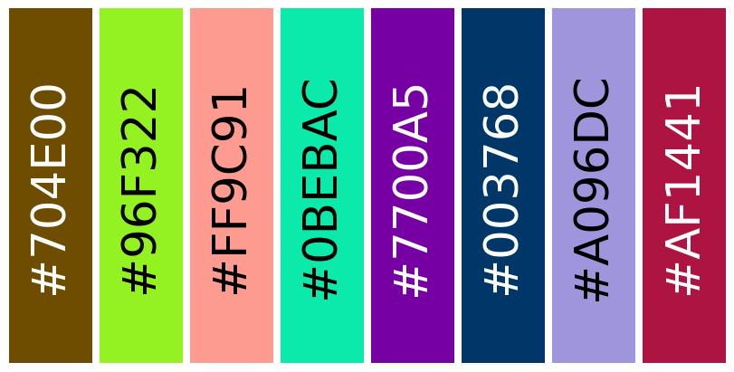

# color-pallete
Generates N colors that are noticeably different from neighbors.
Just run notebook, specify number of colors and click "Generate".

Result example:

[Colab notebook](https://colab.research.google.com/github/slavust/color-pallete/blob/main/color-pallete.ipynb)
